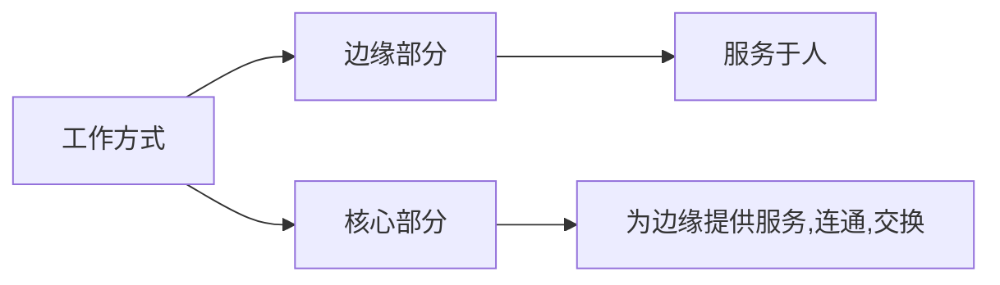
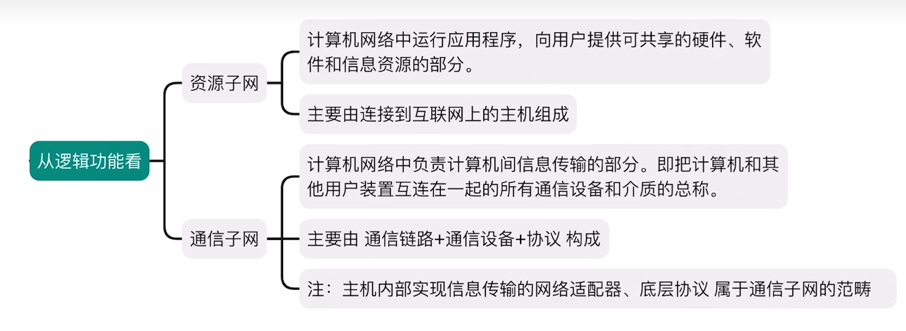

[TOC]

# 第一章 体系结构

## 1	概述

### 1.1 概念

```
一般认为，计算机网络是一个将众多分散的、自治（一个设备的损坏并不会影响另一个设备的使用）的计算机系统，通过通信设备与线路连接 起来，由功能完善的软件实现资源共享和信息传递的系统。
```

```
计算机网络（简称网络）由若干结点(node，或译为节点）和连接这些结点的链路(link) 组成。网络中的结点可以是计算机、集线器、交换机或路由器等。
网络之间还可通过路由器互连， 构成一个覆盖范围更广的计算机网络，这样的网络称为互连网(internet).
```

tip：家用路由器=交换机+路由器+其他功能

​		交换机、集线器连接结点，路由器连接网络

```
ISP（Inernet Service Provider）和国际机构建立的全国范围的互连网，即因特网，互联网。必须使用TCP？IP通讯 
```

### 1.2 组成

```mermaid
flowchart LR
组成成分 -->硬件 & 软件 & 协议
硬件 -->主机 --> 如电脑等,也叫作端系统
硬件 --> 通信设备 & 通信链路
通信设备 --> 如路由器等
通信链路 --> 如光纤
协议 --> 由软件硬件共同实现 --> 如主机里的网卡,即网络适配器
```



固件：特殊的软件





### 1.3 功能

功能：数据通信、资源共享（硬件，软件，数据），分布式处理、提供可靠性（服务器集群，互为替代机，进行冗余备份），负载均衡（使用多个服务器共同实现一个大功能），other


### 1.4 交换

电路交换（物理线路的交换，动态分配资源）:建立连接，通信，释放资源

```
电路交换技术的优点如下： 
1）通信时延小。因为通信线路为通信双方专用，数据直达，所以传输时延非常小。 
2）有序传输。双方通信时按发送顺序传送数据，不存在失序问题。 
3）没有冲突。不同的通信双方拥有不同的信道，不会出现争用物理信道的问题。 
4）适用范围广。电路交换既适用于传输模拟信号，又适用于传输数字信号。 
5）实时性强。通信双方之间的物理通路一旦建立，双方就可随时通信。 
6）控制简单。电路交换的交换设备（交换机等）及控制均较简单。
```

```
电路交换技术的缺点如下： 
1）建立连接时间长。电路交换的平均连接建立时间对计算机通信来说太长。 
2）线路利用率低。物理通路被通信双方独占，即使线路空闲，也不能供其他用户使用。 
3）灵活性差。物理通路中的任何一点出现故障，就必须重新拨号建立新的连接。 
4）难以规袼化。不同类型、不同规格、不同速率的终端很难相互进行通信。 
5）难以实现差错控制。
```

适合低频大量传输


报文交换

报文包括控制信息（发送方与接送方等）与用户数据（即内容）

存储转发的思想：把发送的数据先存储进中间节点，再根据目的地址转发至下一节点。

```
报文交换技术的优点如下： 
1）无须建立连接。通信前无须建立连接，没有建立连接时延，用户可随时发送报文。 
2）动态分配线路。交换设各存储整个报文后，选择一条合适的空闲线路，转发报文。 
3）线路可靠性高。若某条传输路径发生故障，则可重新选择另一条路径传输数据。 
4）线路利用率高。报文在哪段链路上传送时才占用这段链路的通信资源。 
5）提供多目标服务。一个报文可以同时发送给多个目的地址。 
```

```
报文交换技术的缺点如下： 
1)转发时延高。交换结点要将报文整体接收完后，才能查找转发表转发到下一个结点。 
2）缓存开销大。报文的大小没有限制，这就要求交换结点拥有较大的缓存空间。 
3）错误处理低效。报文较长时，发生错误的概率相对更大，重传整个报文的代价也很大
```


分组交换

类似报文交换，但是对原本的报文进行了分组（定长）处理，包含分组号等信息

```
分组定长，方便存储转发管理 。
分组的存储转发时间开销小、缓存开销小 
分组不易出错，重传代价低
```

```
相比于报文交换，控制信息占比增加
 相比于电路交换，依然存在存储转发时延
 服文被拆分为多个分组，传输过程中可能出现失序、丢失等问题0增加处理的复杂度
```

虚电路交换：分组+电路，见第四章


交换性能：

|                      | 电报 | 报文 | 分组 |
| -------------------- | ---- | ---- | ---- |
| 完成传输所需时间     | 1    | 3    | 2    |
| 存储转发时延         | 1    | 3    | 2    |
| 通讯是否需要建立连接 | V    | X    | X    |
| 缓存开销             | 1    | 3    | 2    |
| 是否支持差错控制     | X    | V    | V    |
| 报文有序到达         | V    | V    | X    |
| 是否需要而外控制信息 | X    | V    | V    |
| 线路分配灵活性       | 3    | 2    | 1    |
| 线路利用率           | 3    | 2    | 1    |


### 1.5 计算机网络分类

1. 分布范围：广域网（WAN，跨省），城域网（MAN，跨市），局域网（LAN，几十米到几公里），个域网（PAN，WAPN，现在一般指蓝牙等互联方式）

> MAN和LAN均使用以太网技术进行通信，以太网几乎为局域网的代名词，MAN常被纳入LAN范畴

交换机的全称为以太网交换机


2. 传输技术：广播式网络（通过检查数据的目标的地址来决定是否接收），点对点网络


3. 拓扑结构：总线式（数据广播式传输，但存在总线争用问题），环形结构：（广播式传输，通过数字令牌解决总线争用问题，同一时间啊仅有一个设备有发送权限），星形结构（由中央设备实现点对点传输，如交换机），网状结构（通过中间结点实现逐一存储转发，实现点对点传输，如WAN,好但是贵）


4. 使用者：公用网，专用网


5. 传输介质：有线网络，无线网络


### 1.6 性能指标

信道：向某一反向传输信息的通道，一条通信线路一般对应一条发送信道和一条接收信道

1. 速率：比特率，bit/s，b/s，bps，1B=8b，

	> 计算机网络中，k，M间为1000，计组一般为1024

2. 带宽:某信道所能传送的最高数据率，也指某信道运行通过的信号频带范围，一般指前者

	下行带宽->接收,上行带宽->发送

	> 节点间通信实际能达到的最高速率由带宽，节点性能共同限制（如：网线，路由器的WAN口）

3. 单位时间内通过某个网络/信道/接口的实际数据量（接收和发送相加）

4. 时延：数据从网络的一端传送到另一端所需的时间

5. 发送时延（传输时延，节点将数据推向信道），传播时延（在信道中的时间），处理时延（被路由器处理花的时间）&排队时延（进出路由器的时间）

6. 时延带宽积:传播时延x带宽，一条链路中已从发送端发出但尚未到达接收端的最大比特数

7. 往返时延：从发送方发送**完**消息到发送方收到接收方的确认总共经历的时间

8. 信道利用率：信道有数据通过的时间的占比


## 2——体系结构与参考模型

### 2.1 分层结构

物理层——数据链路层——网络层——应用层（五层模型）

还有OSI参考模型（法律标准）和TCP/IP模型（事实标准）等模型

数据的接收：从左往右

数据的发送：从右往左

分层结构设计不唯一

同一功能可以在多个层次反复出现

```
网络的体系结构(NetworkArchitecture)是计算机网络的各层及其协议的集合，就疋 这个计算机网络及其构件所应完成的功能的精确定义（不涉及实现）。
```

实现是遵循这种体系结构的前提下具体实现的方法

```
将网络的分层结构中，第n层的活动元素（软件+硬件）称为第n层实体，不同机器上的同一层称为对等层，同一层的实体称为对等实体
```

### 2.2 概念

```
协议：控制对等实体之间进行通信的规则的集合，是水平的
```

```
接口，同一节点内相邻两次交换信息的逻辑接口，又称为服务访问点
```

```
服务：下层为紧邻的上层提供的功能二调用，是垂直的（物理层为最底层）
```

协议数据单元（PDU）：对等层次之间传输的数据单位，第n层的记为n-PDU（下面同理）

协议控制信息（PCI）：控制协议操作的信息

协议数据单元（SDU）：为完成上层实体所需功能而传送的数据

n-SDU+n-PCI=n-PDU=(n-1)SDU


协议的三要素：

语法：数据和控制信息的格式

语义：需要发出何种控制信息，完成何种动作及做出何种应答

同步（时序）：对事件实现顺序的详细说明，即执行各种操作的条件/时序关系


### 2.3 其他模型

OSI模型：物理层——数据链路层——网络层——传输层（运输层）——会话层——表示层——应用层

TCP/IP模型：网络接口层——网络层（网际层）——传输层——应用层

常见网络设备的功能层级（OSI）：

主机包括全部

集线器：1

交换机：1，2

路由器：1，2，3

```
物理层：实现相邻节点之间比特的传输
需要定义电路接口的参数（形状，尺寸，引脚数等）
还需定义传输信号的含义和电气特性（高低电平，一bit的持续时间）
```

```
链路层：=确保相邻节点之间的链路逻辑上无差错
差错控制：检错+纠错/纠错+丢弃+重传（使用校验编码技术）
流量控制：协调两个节点间的速率
以上以帧为单位
```

```
网络层：把分组（数据报）从源节点转发到目标节点
路由选择：构建并维护路由表，决定分组到目标节点的最佳路径
分组控制：将分组从合适的端口转发出去
拥塞控制：发现网络拥塞，并采取措施缓解拥塞
网络互联：实现异构网络互联
差错控制，流量控制（以分组为单位），建立连接与释放（虚电路），可靠传输管理（回复前一个节点）
向上层提供的服务类型
有连接可靠的服务（虚电路）
无连接不可靠的服务（数据报即分组交换）
```

```
传输层：实现端（端口）到端的通信（即进程到进程间的通信），通过报文端
多个进程可同时使用传输层，称为复用
传输层的一个报文段可向多个端口传信息，称为分用
差错控制，流量控制（以报文段为单位），建立连接与释放，可靠传输管理
```

```
会话层：管理进程间会话
会话管理：采用检查点机制，当通信失效时从检查点继续恢复通信
```

```
表示层：解决不同主机信息表示不一致的问题（编码问题）
```

```
应用层：实现特定的应用功能，通过报文进行联系
```

报文——报文端——分组/数据报——帧——比特


不是所有应用都需要数据格式转换，会话管理，因此表示层和会话层可合入应用层（TCP/IP）

网络接口层仅规定其任务，不规定方式，比物理层和链路层更加灵活

数据的局部正确不低于全局正确但全局正确可推出局部正确

因此TCP/IP的网络层去除了差错控制，流量控制，建立连接与释放，可靠传输管理的功能

TCP/IP的传输层向上层提供的服务类型：

有连接可靠的服务（TCP协议）

无连接不可靠的服务（UDP协议）