[TOC]

# 数据链路层

## 功能

### 地位

使用物理层提供的比特传输服务

为网络层提供服务，将网络层的IP数据报封装成帧，传给下一相邻结点

物理链路：传输介质（0层）+物理层（1层）实现相邻结点的物理链路

逻辑链路：数据链路层基于物理链路实现相邻结点之间逻辑上无差错的数据链路（逻辑链路）

## 组帧

#### 字节计数法

在每个帧开头，用一个定长计数计数表示帧长

> 帧长=计数字段长度+帧的数据部分长度

缺点：任何一个计数字段出错，后续都无法进行定界

#### 字节填充法

约定两个特殊符号SOH，EOT的作为控制字符，位于ascii编码里，放于帧开头

通过在SOH和EOH之前加上转义字符ESC，使得这两者可以出现在数据段

接收方在接收到ESC时会删去它，保留后面一个字节

#### 零比特填充法

使用01111110作为开头结尾

发送方每当连续遇到5个1，填充1个0，接收方做逆运算

常用，如HDLC协议，PPP协议

#### 违规编码法

对进行的编码进行违规，如曼切斯特编码但是中间不跳

## 差错控制

发送并解决一个帧内部的位错误

#### 校验编码

##### 奇偶校验码

奇校验码：整个校验码（有效信息位和校验位）中“1”的个数为奇数

> 偶校验适用性更强（各信息进行异或运算的结国就是偶校验位）

##### 循环冗余校验码（CRC）

数据接收发送方约定一个除数（由生成多项式确定），K个信息位和R个校验位作为被除数，添加校验位后保证结果余数为0（R=生成多形式的最高位次幂）

将信息码左移3位，低位补0，用生成多项式对其进行模2除法

模2除：从前往后，仅对第一位求商，后面的进行异或

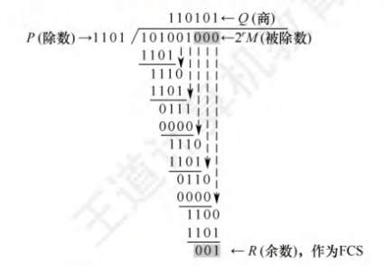

接收方得到数据的余数可以得到出错位的范围（一一对应）

若生成多项式合适，2^R^ >=K+R+1则CRC可以纠1位错

理论上可以检测出所有奇数个错误，所有双比特错误，所有小于等于校验位长度的连续错误

#### 纠错编码（海明码）

将信息位分组进行偶校验

信息位n位，校验位k个，2^k^ >=n+k+1

校验位放在海明位位号为2^i-1^ 的位置上，其余信息按顺序

将信息位的位置号转化为二进制，按顺序一一进行偶校验，结果填入对应的校验位

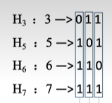

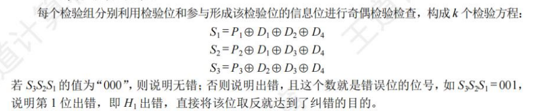

纠错能力1位，检错能力2位

实际使用会添加一个全校验码

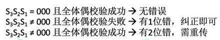

分组依据：校验位Pi与位置序号第i位为1的信息位归为一组

## 流量控制

### 滑动窗口机制

发送窗口：发送方当前允许发送的帧，发送窗口之外的不允许发送

接收窗口：接收方当前允许接收的帧，接收窗口之外的直接丢弃

由接收方通过确认机制控制发送方窗口向前滑动，实现流量控制

### 停止等待协议（SW)

发送窗口与接收窗口均为1

若接收方收到i号帧，且没检测出差错，向发送方返回确认帧ACK_i

若发送方超时未收到ACK_i,则重传i号帧

使用nbit给帧编号,W~T~+W~R~ <=2^n^

首部和尾部需要包含帧定界，帧类型与帧序号

 确认帧丢失会导致帧重复，帧重复会进行丢弃，并返回重复帧的确定帧

### 后退N帧协议（GBN）

W ~T~ >1 W ~R~ =1

其他与SW协议相同

特殊规则：

接收方可以累计确认，即连续接收到多个数据帧后，仅返回收到的最后一个帧的ACk

若发送方超时未收到ACK_i，则重传第一、帧与之后的帧

> W~T~+W~R~ <=2^n^是保证帧有序的约束，帮助判断重复帧

### 选择重传协议（SR）

W ~T~ >1 W ~R~ >1,W ~T~ >= W ~R~ 

若接收方收到i号帧，且没检测出差错，向发送方返回确认帧ACK_i

若发送方超时未收到ACK_i,则重传i号帧

特殊规则：

若接收方收到i号帧，检测出i号帧有差错，则丢弃该帧，并发送否认帧NAK_i，发送方收到NAK_i后进行重传

### 信道利用率分析

理想情况：无帧丢失、比特错误等异常。

|        参数        |  符号  |
| :----------------: | :----: |
| **数据帧传输时延** | *T^D^* |
| **确认帧传输时延** | *T*^A^ |
|  **往返传播时延**  | *RTT*  |

S-W协议的信道利用率计算公式为：

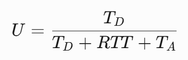

其他两种协议的信道利用率计算公式为：（N为发送窗口大小）

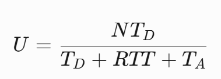

> 滑动窗口协议指GBN或SR

> ARQ协议：自动重传请求协议，上面3个都是
>
> 连续ARQ协议：指GBN或SR

## 介质访问控制（MAC)

多个结点共享一个总线型广播信道，用于解决信号冲突的方法

### 信道划分

#### 时分复用（TDM）

将时间分为等长的TDM帧，每个TDM帧又分为等长的时隙，将m个时隙分配给m对结点使用

每个节点最多分配到信道总带宽的的1/m

如果节点不发送数据，时隙闲置，信道利用率低

#### 统计时分复用（STDM）

异步时分复用：在TDM基础上，动态按序分配时隙

#### 频分复用（FDM）

将信道的总频带划分为多个子频带（使用复用器），每个字频带作为一个子信道，每对用户使用一个子信道（借用分用器）

子频带间有隔离频带

仅适用于模拟信号

#### 波分复用（WDM）

光的频分复用

#### 码分复用（CDM）

给各个节点分配码片序列，包含m个码片，可以视为m维向量，每个分量为1或-1

如果a表示节点A的码片序列，则A发a时表示1，发-a时表示1，各个节点知道彼此的码片序列，要求节点的码片序列相互正交

接收点将叠加的信号（码片序列的向量和）与发送的节点的码片序列分别做规格化内积（a*b/m），结果为发送方信号的值

### 随机访问

#### ALOHA协议

##### 纯ALOHA协议

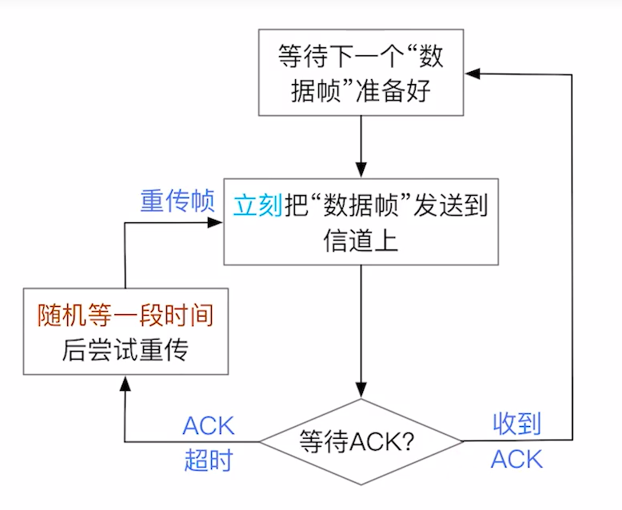

##### 时隙**ALOHA协议**

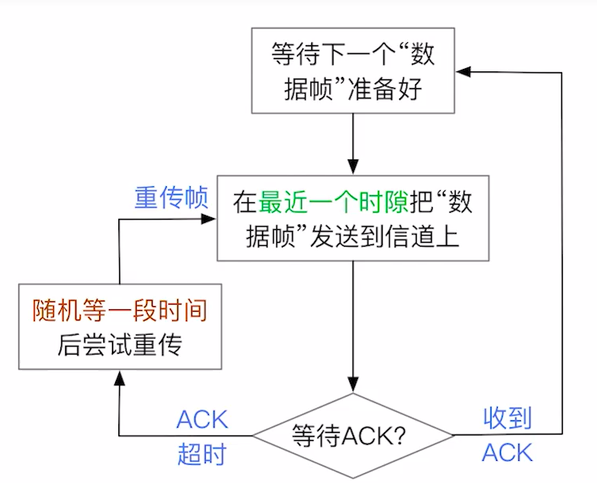

时隙大小固定=传输一个最长帧所需的时间

只有每个时隙开始时才能发送帧

#### CSMA协议

改进ALOHA协议，在发送数据前监听信道是否空闲，空闲时才尝试发送

节点的网络适配器需要安装载波监听装置

##### 1-坚持CSMA协议

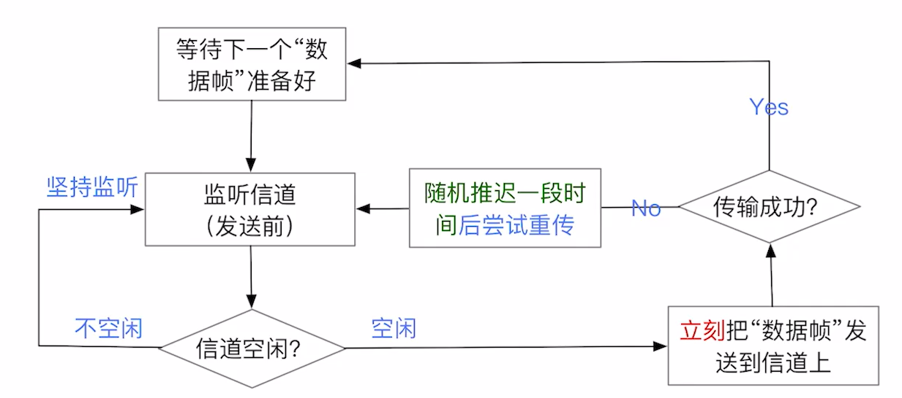

##### 非坚持CSMA协议

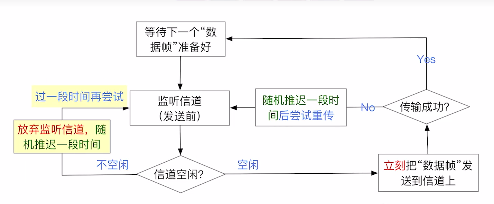

##### p-坚持CSMA协议

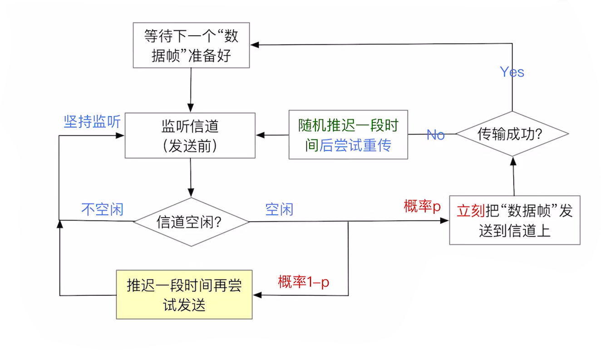

#### CSMA/CD协议

CD：冲突检测

用于早期有线以太网（总线型）

先听后发，边听后发，冲突重发，随机重发

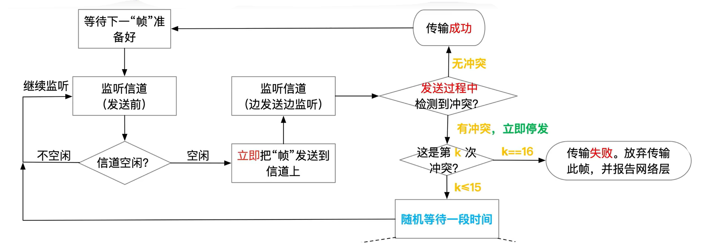

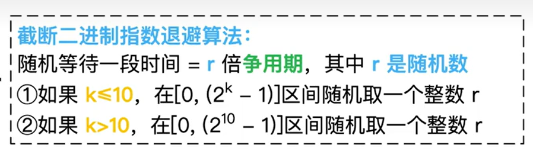

争用期=2*最远单向传播时延

争用期没检测到冲突，本帧发送就不可能发生冲突

CSMA/CD没有ACK机制，若发送过程中未检测到冲突，则认为帧发送成功

最短帧长=争用期*信道带宽（防止忽略冲突）

接受到小于最短帧长的直接丢弃

最长帧长：防止节点一直占用信道

以太网：最短帧长=64B，最长帧长=1518B

#### CSMA/CA

用于无线网络

CA：冲突避免

AP：Access Point，接入点，包含在家用路由器中，即WIFI热点

所有移动站点都需要与固定站点进行通信、

无线网络硬件上很难实现边听边发，冲突检测（强信号会狠狠覆盖弱信号，同时信号强弱变化很大）同时存在隐蔽站问题（移动站之间可能无法听到对方信号）

故无法使用CSMA/CD

发送方：先听后发，忙则退避

若空闲，则隔DIFS后一口气将帧全部发完，反之则进行随机退避

DIFS：分布式协调IFS，最长的帧间间隔

SIFS：最短的帧间间隔，预留SIFS用于处理收到的帧

接收方：SW协议，发送方超时未接收到ACK，则进行随机退避

随机退避：使用二进制指数退避算法确定一段退避时间，退避时间仅在监听到信道空闲时扣除退避时间，归零时发送

信道预约机制（可选，用于处理隐蔽站）：

发送方广播RTS：先听后发，忙则退避

AP广播CTS控制帧

无关节点进行虚拟载波监听机制

发送方接收到CTS后发送数据

AP处理数据

RTS控制帧：包括源地址，目的地址，通信持续时间

CTS控制帧：包括源地址，目的地址，通信持续时间

### 轮询访问

#### 令牌传递协议

网络呈现出令牌环网结构

获得令牌的才可以发送，发送方持有令牌帧

令牌帧可以转换为数据帧

令牌帧：令牌号

数据帧：令牌号，源地址，目标地址，数据，接受flag

接收方成功接受后会修改接受flag

每次拿到令牌仅能发一个帧

无论是令牌帧还是数据帧仅能单向传播

适合高负载情况

#### MAU

多站接入单元，用于集中控制令牌环网

## 局域网

IEEE 802委员会负责局域网标准化工作

将数据链路层划分为逻辑链路控制子层（LLC，已名存实亡）和介质访问控制子层（MAC）

### 概念与结构

覆盖的地理范围小，时延低，误码率低，以帧为单位发送，支持单播（1v1）、广播（1vn），多播（1vk，1<k<n）

分为有线局域网（LAN）和有线局域网（WLAN）

#### LAN

以太网/802.3：

主流，总线型，曼切斯特编码，CSMA/CD协议，中继器之间可以使用光纤实现全双工通信

使用交换机的以太网可以进行全双工或者半双工（CSMA/CD协议），一般取决于网线

令牌环网（已淘汰）

#### WLAN

WIFI/802.11，星型，1个AP+n个移动设备

### 硬件架构

LAN->以太网适配器

WLAN->WI-FI网络适配器

上述均包含RAM用于帧缓存，以及ROM，ROM内存储着其全球唯一的MAC地址

LAN和WLAN的MAC可以不一样

适配器又称为网卡，负责发送与接受帧，实现数据链路+物理层功能，需要支持帧缓冲，完成数据的串/并行转换

将IP数据报封装成帧部分有的系统由主机完成，部分由网络适配器负责

### IEEE 802.3

#### 以太网标准——物理层

同轴电缆仅支持半双工

双绞线：速率<2.5Gbps可支持半双工或者全双工（节点间协商），反之，仅支持全双工

光纤仅支持全双工

中继器的两倍对应两个网段，相邻的网段之间可以使用不同的标准

可以默认交换机连接的终端节点都可全双工，用集线器连接的节点仅支持半双工

#### MAC层

DIX Ethernet V2标准：接受方MAC地址，发送方MAC地址，网络层协议类型（IPv4，IPv6），数据，CRC校验码

802.3标准：接受方MAC地址，发送方MAC地址，数据长度标注，数据，CRC校验码

接受方MAC地址为全1时表示广播帧

6 6 2 N 4 字节

物理层会在以太网MAC帧前面插入8B的前导码，包括前同步码（7B），用于同步，与帧开始定界符（1B）

帧结尾定界可以采用违规编码法，传完后会留一段间隙

路由器和交换机均有MAC地址，集线器没有

路由器收到广播帧后并不会转发给其他网络，仅有在同一个局域网的节点才属于同一个广播域

### 虚拟局域网VLAN

可以将一个大型局域网分割为若干个较小的VLAN，每个VLAN是一个广播域（win的网上邻居），每个VLAN对应一个VLAN

VLAN的划分可以基于接口，MAC地址，IP地址

主机与交换机之间使用标准以太网帧

交换机与交换机之间使用802.1Q帧（在以太网帧的基础上指明了VID，需要改变CRC），6642N4

4包括了：标签类型2字节，指明了是802.1Q帧，4个无用bit，12bit的VID

### WLAN

分为有固定基础设施无线局域网（802.11，又称为WIFI）和无固定基础设施移动自组织网络（如隔空投送等）

通过门户设备将802.11局域网与其他局域网整合在一起

#### 802.11

802.11是星形拓扑，中心点称为接入点（AP），或者称为无线接入点（WAP），在MAC层使用CSMA/CA协议

两个移动站之间必须通过AP进行转发通讯

AP一般具备帧格式转换功能，AP与AP、路由器、交换机等使用有线连接

##### 服务集

基本服务集（BSS）：1个基站（AP）+多个移动站

服务集标识符（SSID）：不超过32字节，无线局域网名称

基本服务区（BSA）：一个BBS能覆盖的地理范围i

扩展服务集（ESS）：将AP通过一个分配系统（DS）连接多个BSS，组成更大的服务集

漫游：一个移动站从一个BSS切换到另一个，仍能保持通迅

##### 帧

分为数据帧，控制帧，管理帧

管理帧：用于探测请求或者响应帧

#### 数据帧格式

30B的MAC首部，至多2312B的主体，4B的FCS（帧检验序列）

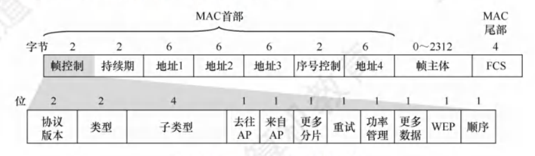

去往AP时：地址1，2，3分别表示接收地址（中转用），发送地址，目标地址

来自AP时：地址1，2，3分别表示目标地址，接收地址（中转用），发送地址

持续期表示在本帧结束后还需要占用多久信道（单位为微秒）

### 广域网WAN

#### PPP协议

点对点协议，一般用于个人计算机与ISP通讯的数据链路层协议，或者WAN中两个路由器之间的连接

包括链路控制协议（LCP），网络控制协议（NCP），将IP数据报封装进串行链路的方法

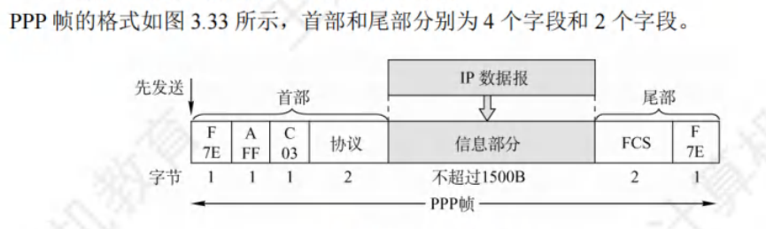

使用异步传输时采用字节填充法，转义字符为0x7D，同步传输时使用零比特填充法

协议段表示信息段运载的类型，可以是IP数据报或者LCP的数据等

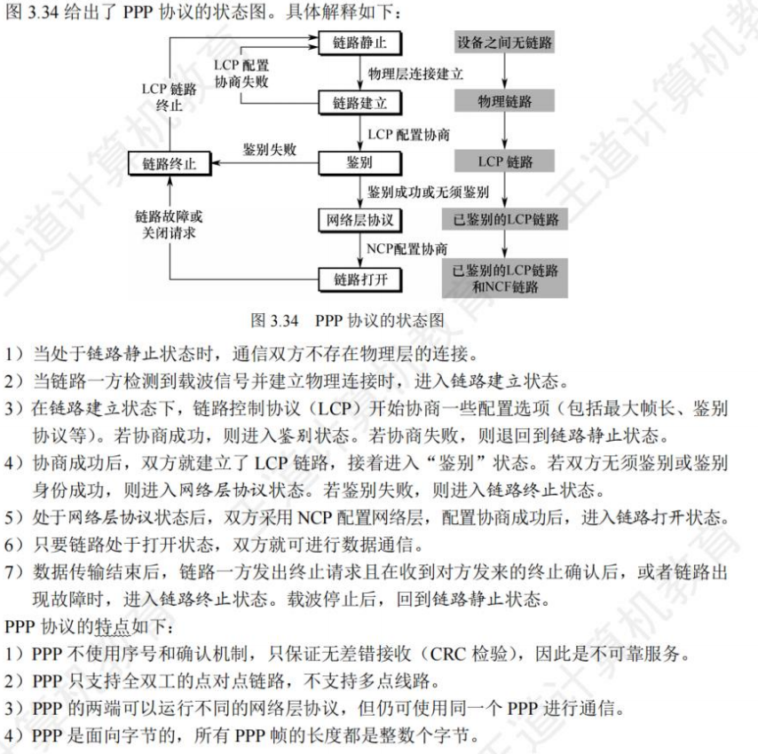

### 数据链路层设备

#### 以太网交换机

根据MAC地址转发帧

##### 自学习功能——即插即用

交换表初始为空，每收到一个帧就将发送方的MAC地址+端口号更新到交换表

如果不知道接收方在哪就进行广播，反之则精确传播

每个表项有有效期，过期作废

##### 交换方式

###### 直通交换

仅接收处理目的地址，类似于电报传播

转发时延低，但是不适合需要速率匹配的情况，不能进行协议转换和差错控制

###### 存储转发交换

接收处理整个帧

