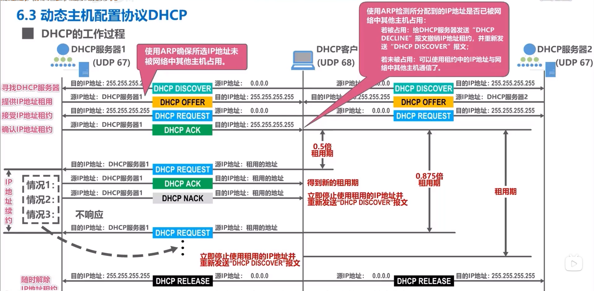

[TOC]

# 网络层

将传输层的数据封装成IP数据报，路由器根据IP数据报中的源IP地址和目标IP地址进行分组转发，实现主机到主机的传输

IP地址：32bit，一般以8bit为一组，表示为10进制

## 功能

### 异构网络互联

每个网络的拓扑结构不同，物理层和链路层的实现不同，主机类型也不同

通过路由器（即TCP/IP中的网关）实现

### 路由和转发

#### 路由

路由器相互配合，规划最佳转发路径，需要“路由协议”，最终形成路由表

接入网络的每一台主机需要一个IP地址

#### 转发

路由器根据自己的转发表（精简版路由表）将IP数据报转发出去

### 拥塞控制

#### 开环控制

提前设置预防拥塞的方法，不修改

#### 闭环控制

动态将拥塞信息传递给路由器，相关路由器及时调整路由表

### SDN（软件定义网络）

路由软件不再存在i.e.不再交换路由信息

存在一个逻辑上集中的远程控制器，实际可以由不同地点的多个服务器组成

由控制器生成最佳路由和转发表，路由器仅进行查表转发

#### OpenFlow协议

是SDN中控制层面（路由算法与路由表）和数据层面（转发表）之间的通信接口

使得远程控制器可以直接对路由器进行直接访问和控制

#### 广义转发

匹配：能对各层首部中的字段进行匹配

执行：转发分组，实现负载均衡，重写IP首部（类似NAT地址转换），人为阻挡或者丢弃一些分组

设备称为OpenFlow交换机或者分组交换机或者交换机

转发表变为流表，由远程控制器管理，可以有一个或多个

流表项包含首部字段值（匹配字段，包含以太网，VLAN，IP，TCP/IP），计数器(已经与该流表项匹配的分组数量，该流表项上次更新到现在经历的时间)，动作（匹配成功执行的动作，转发，丢弃，复制后转发，重写首部后转发等）

北向API：网络控制应用SDN控制器之间的接口

南向API：SDN控制器与受控交换机之间的接口

#### SDN控制器

通信层：与受控交换机通信

网络范围的状态管理层：存储交换机信息等

到网络控制应用程序的接口：连接网络控制应用

## IPv4

IP：internet protocol，网络国际协议

### 帧格式

IP数据报：首部（固定部分，可变部分）+数据部分

固定部分：版本,首部长度（单位：4B，导致可变部分有一部分为填补），区分服务，总长度（16bit，单位B）

标识（由源主机生成），标志（最高位为MF，标识后面是否还有分片，次低位DF，表示是否不被允许分片），片偏移（分片用，单位为8B）

TTL（允许经过的路由器的数目的最大值，如果，减为0时丢弃）,协议（如TCP，UDP等），头部校验和（设为全0表示不用校验，具体见UDP），源IP地址和目标IP地址

> 丢弃分组时向源主机发送ICMP报文

数据部分收总长度限制，存在理论最大和理论最小值，但实际会受到下一段链路的最短最长帧长限制

MTU：最大传输单元，一个链路层能承载的最大数据量，如以太网帧为1500B

如果一个IP数据报的长度超过了MTU，需要进行分片

分片可能发生在源主机，路由器等

只有目的主机会对目的主机进行重组

分片到达主机的顺序可以是乱的

片偏移的单位为8B，因此，发生分片时除最后一个分片，其他分片的数据部分长度必须为8B的整数倍

### 初始IP地址

由ICANN进行分配，分为单播地址（A、B、C类），多播地址（D类），其他（E类）

路由器与路由器之间链接的接口可以不分配IP地址，其他需要，丛属于同一个网络的所有主机的所有IP地址的网络号相同

当一台新主机接入网络时需要分配IP地址和默认网关（默认路由器）

#### 结构

网络号+主机号，ABCD类的网络号开头分别为0，10，110，1110，E为1111

ABC的网络号长度分别为8，16，24bit

转发表：目标网络地址+转发接口

#### 特殊地址（不能分配给主机）

主机号全0表示整个网络本身，只能用于路由表和转发表

主机号全1，表示广播地址，仅能作为目的地址

> 主机号N位则最多有2^N^ -2台主机/路由器

网络号全0，主机号Y非0，表示本网络中主机号为Y的主机，可以作为源地址，不能作为目的地址

网络号、主机号均为0，本网络的本主机，仅可作为源地址，刚接入网络时使用，用于DHCP协议

网络号、主机号均为1，向本网络广播

网络号127，主机号非全0或1，表示主机自己，用于本地软件环回测试

### 子网划分与子网掩码

#### 子网划分

将原本的主机号的前面几位用于作为子网号，将一个网络划分为多个网络

每个子网地址中，主机号全0表示子网本身，全1表示广播

#### 子网掩码

新主机接入网络时需要分配IP地址和默认网关+**子网掩码**

将自身IP与子网掩码相与可以得到自己的网络号与子网号，i.e.网络前缀，相同则为同一网络

子网掩码前面为1，位数与网络前缀相同，后面均为0

此时路由器转发表需要增加**子网掩码**，接收到后先和储存的子网掩码与，再对比是不是目标网络编号

默认子网掩码用于兼容未使用子网掩码技术的路由，位数与网络类别相关

默认路由的目的网络号与子网掩码均为全0

> 子网掩码的表示还可以用IP后面跟一个/N，N为网络前缀位数

> 自治系统，一个网络内使用多台路由器，仅一台路由器负责对外转发，其他路由器用于子网之间的联系，用于应对子网过多的情况

### CIDR（无分类编址）

取代了ABCDE这种固定的分类

结构：可变长网络前缀+主机号，共32bit

获得CIDR地址块后可以将其划分成多个子网，分为定长子网划分和不定长子网划分》

> 11与00不能分配

子网的划分类似于哈夫曼树，任何一个子网的前缀的前缀不能是其他子网的前缀

每一个叶节点对应一个子网，必须为二叉树

树高最多为h-1（主机号长为h）

### 路由聚合

如果多个表项的转发接口相同同时目的网路的网络前缀的前缀相同，可以将其聚合成一个表项

减少路由表的大小和提高查询速度

可能会引入不存在的额外的无用地址，可能导致一个一个目的IP地址与多个表项都能匹配，这时需要遵循最长前缀匹配原则

> 其实之前就已经用了，如任何地址都和默认路由匹配

> 默认网关不一样要是与之直连的路由器

### VPN（虚拟专用网）

利用公网的因特网作为专用网的通信载体

给专用网内各主机配置的IP地址应该是该专用网所在机构可以自行分配的IP地址，仅在机构内有效

这些地址可以选的范围有具体规定，路由器对目的地址为专用地址的IP数据报一律不转发

### NAT 网络地址转换

端口号：传输层可以定义2^16^ 个端口号用于分配给进程，进程与进程之间的通信可以使用IP+端口号实现，每个主机相互独立

局域网的多台主机使用一个IP（公网IP，全球唯一），通过IP+端口号的形式实现正常通信

内网IP：每个局域网内部可以自由分配，只要求局域网内唯一，也就是控制面板内的IP（现在一般为路由器自动分配）

#### NAT路由器

包含传输层的功能，转发IP数据报时，进行内网IP和外网IP的相互转换

NAT表：记录内网地址+端口号与外网地址+端口号之间的映射关系

路由器根据NAT表修改帧信息

在通讯时，源地址和端口号填的是内网的，目的地址与端口号指向公网

### ARP协议（地址解析协议）

用于查询同一网络中IP地址与MAC地址之间的映射关系

数据结构（PDU）为ARP分组，与IP分组同级，通过MAC帧的第三部分指明

ARP表存储在ARP缓存中，每台路由器和主机都有，需要定期更新

#### 工作过程

ARP请求分组：封装成MAC帧，目的地址为全1用于广播，包含自身IP地址和MAC地址和实际目的地址的IP

ARP响应分组：包含自身IP和MAC地址，为单播帧

### DHCP（动态主机配置协议）

使用UDP协议，服务器端端口默认为67，客户端为68

给刚接入网络的主机动态分配IP地址，配置子网掩码，默认网关等

属于应用程协议，使用UDP的服务，一般每个网络会配备一台DHCP主机

需要依次被封装成UDP数据报，IP数据报，MAC帧

一般家用路由器中包含

#### 过程

DHCP 发现报文：新加入主机的MAC地址，目标端口号(由国际标准特别约定了)，源端口号（UDP数据报），广播帧（IP数据报与MAC帧）

DHCP offer报文：提供的IP地址，IP地址租用期，子网掩码，默认网关，广播帧（IP数据报），单播帧（MAC帧）

> 使用ARP确认所选IP地址未被网络中的其他主机占用

DHCP 请求报文：自身MAC地址，接收的IP地址（即offer给的），源地址仍然为全0，广播帧（IP数据报与MAC帧）

> 大型网络可能有多台DHCP服务器，因此可能有多个offer，需要选

> 当IP地址租用期过半时会向服务器重新发送DHCP 请求报文，未响应则在87.5%时再发一遍

DHCP 确认报文：与offer相同

DHCP撤销报文：使用ARP确认所选IP地址未被网络中的其他主机占用，若被占用，则向服务器发送该报文，后面重新发送DHCP 发现报文

DHCP否认报文：当客户IP地址租用期过半时不同意续租发的报文，客户接收后需要重新申请IP

DHCP释放报文：客户随时可以向服务器弃租，此时源IP地址为0.0.0.0

中继代理：给路由器配置DHCP服务器的IP地址使之成为DHCP中继代理（路由器会默认丢弃广播的IP数据报）

> 原因：不想在每一个网络里都配置DHCP服务器

### ICMP（网络控制协议）

用于有效转发IP数据报和提高IP数据交付成功概率，于网际层使用，被封装在IP数据报里

主机和路由器用其发送差错报告报文和询问报文

#### 报文类型

差错报告报文：报告差错情况，如终点不可达（细分为13种），源点抑制（由于拥塞而丢弃IP分组，使源点降低发送时间），时间超过（TTL为0时丢弃或者终点未在预定时间内收到全部分组，会把已收到的丢弃），参数问题（发现首段不正确），改变路由（重定向，让主机知道实际走其他路更好）

询问报文：询问情况，如回送请求和回答（用于测试目的站是否可达及了解其状况），时间戳请求和回答（用于进行时钟同步和测量时间）

#### 应用示例

分组网间探测ping：使用回送请求和回答测试主机与路由器之间的连通性，即win命令行里的ping指令

跟踪路由：用于探测IP数据报从源主机到目的主机要经过哪些路由器即win命令行里的tracert，差错报告报文与回送请求和回答

## IPv6

### 主要变化

更大地址空间，扩展的地址层次性，首部可扩展，分组允许包含控制信息，允许协议再补充，支持即插即用（无须DHCP），支持资源预分配

### 基本首部与扩展首部

IP数据报=基本首部+有效载荷（40+N）

有效载荷（净负荷）=扩展首部+数据部分

基本首部=版本+通信量类+流标号+有效载荷长度+下一个首部+跳数限制+源地址+目的地址

通信量类用于区分不同IP分组的类别或者优先级

> 流指因特网上由特定源点到特定终点的一系列IP数据报
>
> 处于同一个流上的数据报具有相同的流标号

流标号用于资源分配

下一个首部字段可以用于指明数据单元的协议或者表示第一个扩展首部的类型

IPv4的选项字段每个经过的路由器都有查，而IPv6仅源点和终点的主机查

#### 扩展首部

每个拓展首部开头8bit用于指明下一个扩展首部类型，

逐跳选项

路由选择

分片

鉴别

封装安全有效载荷

目的站选项

### 地址表示

使用十六进制记法，左侧零省略（每段最前面），连续零省略（一连串0可以用冒号代替）（仅可使用一次，避免歧义）

可以结合点分十进制的后缀，用于过渡

CIDR的斜线表示法仍有效

### 地址分类

未指明地址：全0，不可作为目的地址，用于初始化

环回地址：最低比特为1，其他为0，与IPv4的作用相同（传回自身）

多播地址：最高8bit为全1

本地链路单播地址：最高10bit为9个1+1个0（类似D类，路由器不会转发任何以链路本地地址为源地址或目的地址的数据包）

全球单播地址：全球路由选择前缀+子网标识符+接口标识符（替代了ARP协议）（48bit+16bit+64bit）

目的地址：单播，多播（广播视为多播特例），任播（任播终点为一组计算机，但数据报仅交付一个，一般是由路由算法得出的距离最近的一个）

### 过渡策略

逐步演进，保证向后兼容

#### 双协议栈

使部分主机既有IPv6地址又有IPv4地址，使用DNS查询目的主机使用的IP地址

将IPv6数据报转换为IPv4数据报再转换回去会导致一些信息不可避免的丢失，比如流标号

#### 隧道

当IPv6数据报进入IPv4网络时，直接将其封装进IPv4数据报，设置协议字段为41

### ICMPv6

合并了ARP和IGMP，IPV6仅有这一个网际层协议

#### 报文封装

紧跟在ICMPv6报文前的首部的下一个首部值设为58

#### 报文分类

差错报告

回送请求与回答

多播观众发现（负责IGMP）

邻站发现（包含ARP）

> 内容大致相同于IPv4

## 路由算法与路由协议

路由器实现交换结构的三种基本方式：存储器，总线，互连网络

### 路由选择

#### 静态路由

人工手动配置路由表

#### 特定主机路由

针对某一特定主机专门配置路由表，子网掩码为32

### 因特网使用的协议

使用动态路由，具有自适应性，划分为多个AS，由多个路由器进行交互的结果

域间使用EGP（外部网关协议），域内使用IGP（内部网关协议）

两个AS的IGP不必相同

### IGP

#### RIP(路由信息协议)

属于应用层协议

要求AS内每一个路由器都要维护主机到AS其他每一个网络的距离记录，即一组距离向量（D-V）

使用跳数作为度量来衡量到达目的网络的距离

将路由器到直连网络的距离定义为1，非直连的距离定义为所经过的路由器数+1

最多允许一条路径包含15个路由器，不然视为不可达

认为所经过路由器数量最少的路由最好（忽略了带宽）

当距离相同时进行等价负载均衡

RIP中路由器仅和相邻路由器周期性交换信息（路由表i.e.本路由器到AS中各网络的最短RIP距离，及到各网络所经过的下一跳路由器），在网络拓扑发生变化时会进行触发更新

初始时仅知道到直连网络的距离为1，通过交换直到收敛

接收到相邻路由器的信息后将路由表的距离加1，更改下一跳为相邻路由器，凭借此更新自己的路由表

更新原则：到达目的网络，相同的下一跳进行更新：发现新网络添加：到达目的网络，不同的下一跳，新路由距离短，进行更新；到达目的网络，不同的下一跳，距离相同，添加，用于等价负载均衡

大概每隔30s发生路由更新报文，超过一定时间未收到某个路由器的更新报文，则视其为不可达，再过一段时间仍然未收到，则删除这条路由条目

可能会发生路由环路，需要很长时间才能知道不可达，可以通过限制RIP距离，进行触发更新，进行水平分割（不让同一路由信息通过接收口反方向发送）

##### 相关报文

支持变长子网掩码和CIDR，提供简单鉴别且支持多播，使用UDP进行封装，端口号固定为520

#### OSPF（开放最短路径优先）

属于网际层协议

开放指公开发表的

为了克服RIP的缺点使用最短路径算法，基于链路状态，不会产生路由环路，不限制网络规模，更新快，收敛快

LS（链路状态）：包括本路由器与哪些路由器相连，以及对应链路的cost

问候分组：用于建立和维护邻居关系，封装在IP数据报中，目的地址为组播地址224.0.0.5，协议号为89

路由器建立邻居表，邻居表的不可达更新与删除更新与RIP类似

LSA（链路状态通告）：与直连网络和邻居路由器的LS，被封装在LSU（链路状态更新）分组中，使用可靠的洪泛法进行更新

洪泛法：路由器向自己的所有邻居发送链路状态更新分组，接收到该分组的各路由器将其转发给自己的邻居（不包括上游路由器），收到后发送确认，收到重复的无须转发，但是仍要确认。

LSDB（链路状态数据库）：用于LSA，每个路由器都有，洪泛法的结果使AS中所有路由器的LSDB一致，后续使用dijkstra算法计算路径

##### 分组类型

问候：用于发现和维护邻居路由器的可达性

数据库描述：用于向邻居路由器给出自己的LSDB中所有LS的摘要信息

LS请求：向邻居路由器请求某些LS的详细信息

LS更新：见上面

LS确定：与LS更新配合

顺序：先问候，再描述，有缺少就请求，每隔一段时间会进行洪泛法更新

##### 多点接入网络OSDF路由器

为了减少发送问候分组和LS更新分组的数量，选定指定路由器DR和备用指定路由器BDR，所有非DR/BDR路由器只与DR/BDR建立邻居关系，只通过DR/BDR交换信息

##### OSBF划分区域

将AS划分成一个更小的区域，由区域标识符区分，有主干区域用于连接各区域，每个区域路由器不宜超过200个

BBR（主干路由器）：主干区域的路由器

ASBR（自治系统边界路由器）：用于与其他AS系统交换信息

IR：区域路由器

ABR：区域边界路由器，用于与主干区域连通，交换的信息为自己区域的LSA和其他区域的LSA

### EGP

#### BGP（边界网关协议）

AS的度量标准不同，无法选择最佳路由

需要考虑路由器所有者愿不愿意让你过等因素

配置时，AS需要选择至少一个路由器作为AS的BGP发言人，一般而言，两个BFP发言人通过一个共享网络连接，往往就是BGP边界路由器，使用TCP连接，端口号179，连接的两个BGP发言人称为邻站或者对等站

BGP发言人需要允许自己AS内的IGP，给出其他AS的可达性，从而构建无环路的AS连通图

##### 报文类型

打开：用于两个BGP发言人的通信初始化

保活：周期性验证邻站的连通性

更新：用于告知路由信息等

通知：用于发送检测出的差错

## IP多播

也称组播，实现一对多通信的技术，在因特网上进行的多播称为IP多播，可以减少网络资源的消耗

使用IPv4的D类地址作为多播地址，只能用作目的地址，用于标识多播组

多播组成员可以随意变动，数量地址不受限制，一台主机可以属于多个多播组

尽最大可能交付，不保证多播组内每一个都能收到

多播地址可以分为预留的多播地址（永久多播地址），全球范围内可用的多播地址和本地管理的多播地址

多播可以分为仅在本局域网上进行的硬件多播和在因特网上进行的多播

### 硬件多播

MAC地址有多播MAC地址这种类型，仅需将IPv4多播地址映射成多播MAC地址即可用于局域网内的IP多播

多播MAC地址有具体的格式规范，左起25位相同，仅23位可变，由多播IP地址的后23位直接转化来

IP多播地址与多播MAC地址的映射不是单射，收到IP多播数据报的主机需要在网际层用软件进行过滤

### 因特网上进行的多播

多播路由器需要根据IP多播数据报首部的IP多播地址将其转发到有该多播组成员的局域网

IGMP（网际间管理协议）：用于让连接在本地局域网上的多播路由器知道本局域网上是否有主机（实际为进程）加入或者退出某个多播组，仅在本网络有用、

多播路由协议：在多播路由器之间为每个多播组建立一个多播转发树，不同的多播组的多播转发树不同，而且许需要动态调整，为覆盖全部成员，可能经过不包含多播组的路由器

非多播组的成员也可以向多播组发送数据

> 实际并未广泛应用

#### IGMP

##### 报文类型

成员报告报文：用于告诉路由器自己要加入这一多播组，其他想加入该多播组的主机接收到后会不再发送，内容为多播地址，目的地址也为多播地址

成员查询报文：路由器每隔一段时间对直连网络进行成员查询内容为全0的IP地址，目的地址为224.0.0.1（特殊，所有参与多播的主机和路由器均会接收），也可以指定特定多播组，接收后延迟一段时间发送成员报告报文，其他加入该多播组的主机接收到后会不再发送

> 多播路由器可能不唯一，选择一个作为查询路由器即可（IP地址最小的），其他路由器被动接收就行了

离开组报文：主机离开时发送给路由器的报文，加速更新多播路由器的数据，内容为多播地址，目的地址为224.0.0.2，路由器接收到后立刻进行成员查询，目的地址和内容均为多播地址

被封装在IP数据报里，协议字段为2，TTL为1用于防止被路由器转发

#### 多播路由协议

多播转发树连接多播源和所拥有多播组成员的路由器

##### 构建方法

 基于源树多播路由选择，组共享树多播路由选择

#####  基于源树多播路由选择

反向路径多播（RPM）算法：利用RPB（反向路径广播）建立广播转发树，利用剪枝剪除广播转发树中的下游非成员路由器

> 使用洪泛法形成广播转发树在有环路情况下会无线套娃占带宽

 RPB算法：收到广播分组时检测其是否沿最短路径，是则将分组转发至除接收口的其他接口，反之则丢弃，若存在多条路径，则选取这几条邻居路径中邻居路由器IP地址最小的那条

> 反向路径指把源点当成终点、、

若发现自己是叶节点且不含多播组成员，则发送剪枝分组

若自身或下游包含多播成员，且不在广播组内，则给上游发送嫁接报文

##### 组共享树多播路由选择

采用基于核心的分布式生成树算法

每个多播组指定一个核心路由器，以该路由器为根，建立连接所有多播组的成员路由器的生成树作为多播转发树

其他成员路由器会向自己多播组中的核心路由器单播加入报文，报文朝核心路由器转发，直到其属于该多播生成树的某个节点或根

## 移动IP

使移动主机在各网络之间漫游时仍然能保持原来的IP地址不变

为非移动主机提供了相应机制，使其可以将IP数据报正确发送到移动主机

### 相关概念

归属网络：默认连接的网络或者初始申请接入的网络

归属地址：移动主机在归属地址中的IP地址在整个移动过程中始终不变，也被称为永久地址

归属代理：在归属网络中代表移动主机执行移动管理功能的实体，一般为连接在归属网络上的路由器，在应用层完成

外地网络：当前漫游所在的网络，也称外地网络，被访网络

外地代理：在外地网络中帮移动主机执行移动管理功能的实体

转交地址：外地代理会为移动主机提供一个临时使用的属于外地网络的转交地址

### 工作流程

移动主机通过自己的代理发现协议从外地代理获取转交地址，同时向外地代理注册自己的永久地址和归属代理地址

外地代理记录该信息，并向主机的归属代理注册主机的转交地址（也可以由主机自己完成）

此后归属主机会代替移动主机接收IP数据报，并利用IP隧道技术将这些数据报转发到外地网络中的移动主机

此时，归属地址会以自己的MAC地址回应对移动主机的ARP请求，同时还会主动发送ARP广播，声称自己是该移动主机，用于更新归属网络中其他主机的ARP高速缓存

当外地代理和移动主机不是同一台设备时，转交地址实际为外地代理的地址

转交地址仅作为归属代理到外地代理的IP隧道的出口地址

所有使用同一外地代理的移动主机均可以共用一个转交地址

转发代理接收后解封出原IP数据报，通过注册表查找MAC地址进行转发

移动主机可以将外地代理作为主机的默认路由器，也可以使用外地网络中的其他路由器

#### 其他

移动主机也可以作为自己的外地代理，运行额外的外地代理软件即可，外地网络提供机制，为移动主机提供一个同址转交地址作为其IP地址和外地代理地址

即使在固定主机和移动主机之间有更高效的路径，也必须按上述流程走一遍

可以为固定主机配置一个通信代理，固定主机向移动主机发送的IP数据报均通过通信代理转发，通信代理从归属代理处获取外地代理进行转发，增加复杂度但是高效，会使移动主机对固定主机不再透明

