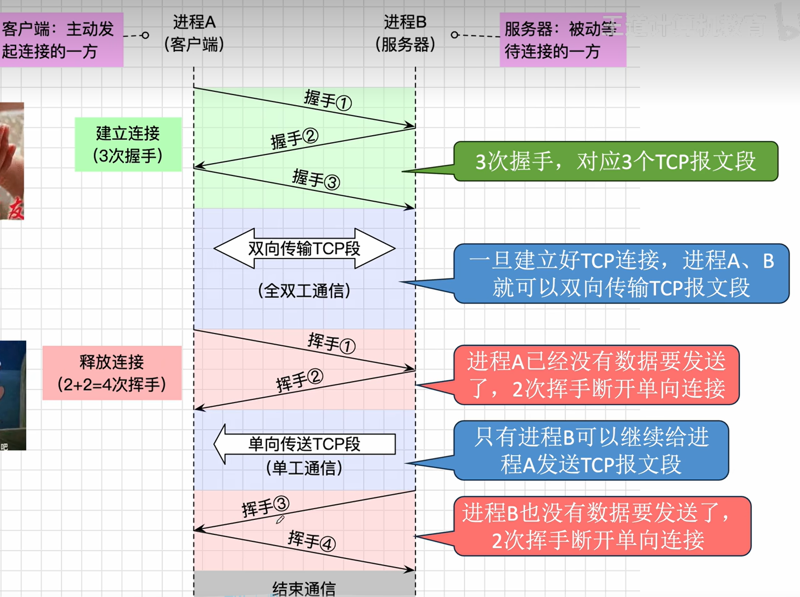
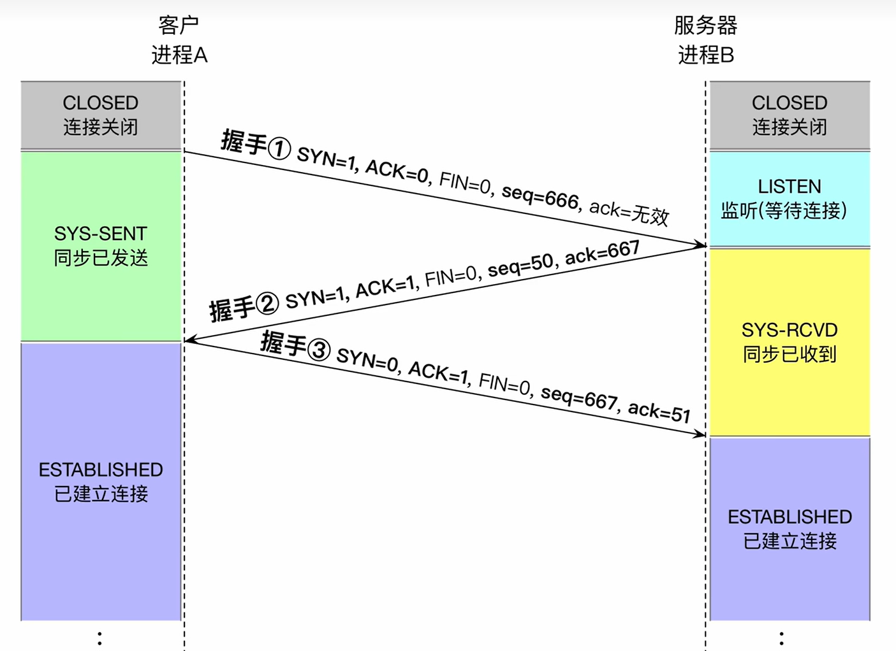
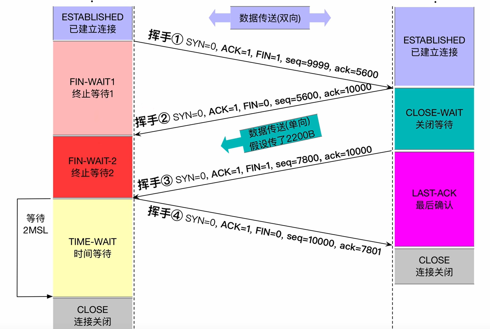
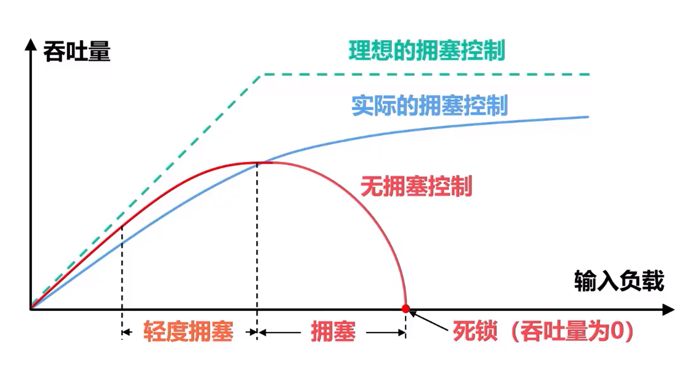
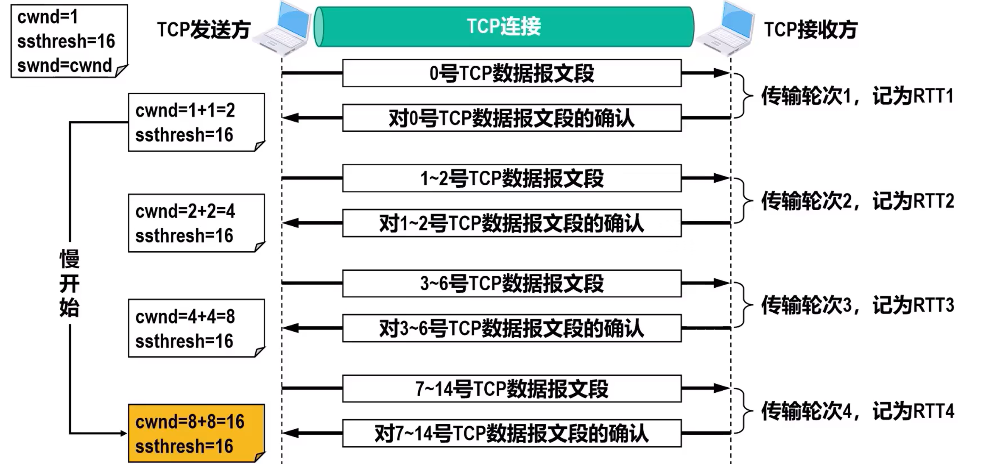
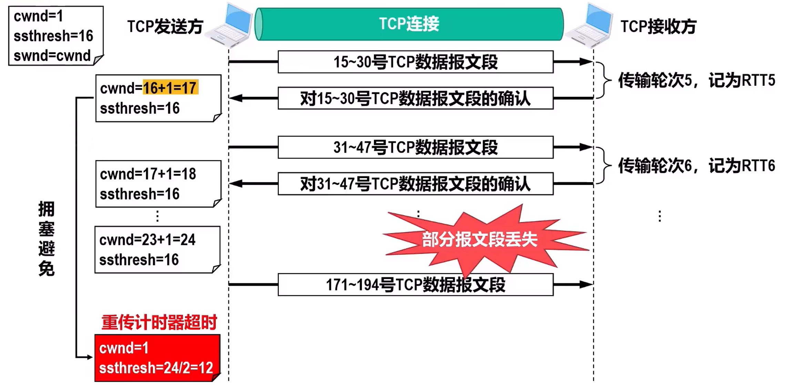
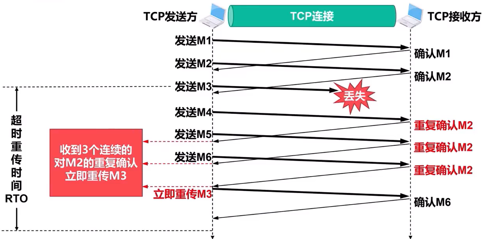
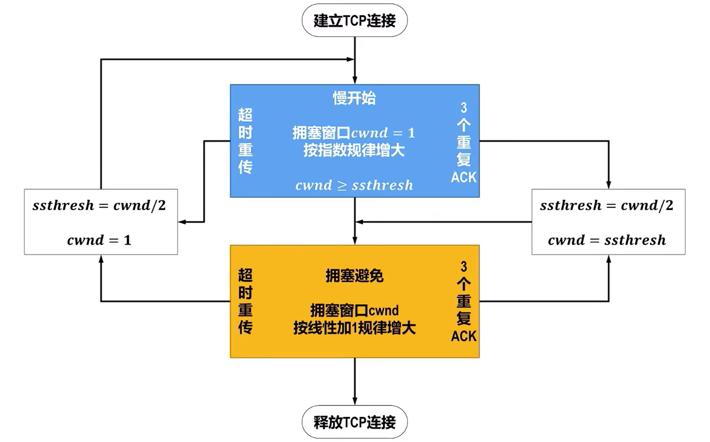
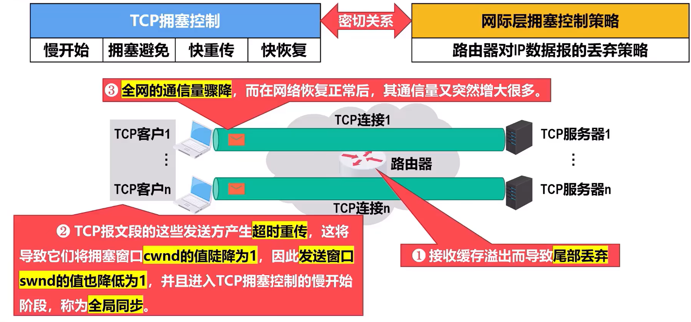
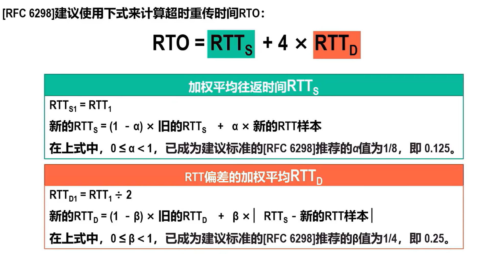

[TOC]

# 传输层

## 提供的服务

#### 端口

传输层根据端口号来区分数据来自/去往哪个进程

两台主机之间的端口号相互独立，TCP和UDP的端口号也相互独立

通信需要指明：协议，进程端口号，对方的IP地址与端口号

> 套接字：IP地址：端口号等，唯一标识一台主机上的一个进程

端口号有16bit，1~49151为服务器使用的（被动通信方），其他为客户端使用的（短暂端口号，主动通信）

其中1-1023为熟知端口号，用于被熟知的重要软件,如DNS，SMTP等

1024~49151为登记端口号

以上为建议标准，非强制标准

#### 功能

复用：发送时，同一个主机上的多个进程可以使用同一个传输层协议

分用：接收数据时，传输层可以把数据正确交付给目的进程

差错控制：TCP检测出错误会丢弃数据，并通知重传，UDP不通知

## UDP

无连接、不可靠的端到端的传输服务

不支持拥塞控制，每次传一个完整的报文，不支持报文自动拆分、重装

首部仅8B，可靠性可以靠进程自己实现

支持一对一，一对多传输（靠IP数据报）

### 数据报

首部：源端口号2B（不需要回复填全0），目的端口号2B，长度2B（理论最长为65535字节，实际受IP数据报长度限制），UDP校验和2B（无须校验填全0）

### 检验

根据校验和拆分数据，如16bit校验和和32bit数据，将数据拆分为两组，相加后结果取反即为校验和

如果最高位发生进位，则加到最低位

数据与校验加起来结果为全1则说明没出错

> IP数据报的首部校验和也是采用类似的方法，但仅使用首部

#### 伪首部

计算校验和前添加在开头，包括源IP地址，目的IP地址，固定字符0，17，以及UDP长度

将伪首部和首部，数据部分分组用于计算校验和

计算完拆除

接收方接收时重新添加

## TCP

面向连接、可靠的端到端的传输服务

仅支持一对一传播

使用TCP报文段（TCP段）

支持拥塞控制，支持报文自动拆分、重装

三大阶段：建立连接（三次握手），数据传输（全双工），释放连接（四次挥手）

客户端：主动发起连接的一方

服务器：被动等待连接的一方

释放连接的顺序没影响

一次TCP连接可以传输多个报文

双方会协商MSS（最大段长，但不要求满载，不包含首部，两边设置的可以不一样）

TCP面向字节流，无论多少个报文，都视为一连串字节流，UDP面向报文

### TCP段

首部包括20B的固定首段，以及可变部分

首段（未按顺序）：源、目的端口，序号（字节流的顺序，数得是bit，简写为seq，不一定从1开始）

确认号（ack/ack_seq，用于反馈序号在该确认号之前的所有字节全被接收成功，数的与seq相同），**ACK**（1时表示ack有效，反之无效，握手【1】是为0）

数据偏移（单位为4B，表示TCP首部长度），填充（用于补足4B），保留（通常制为0）

URG（紧急位，1表示是紧急数据，此时紧急指针有限），紧急指针（紧急数据专用序号）

PSH（推送位，1时表示希望尽快回复，用于交互式通信）

RST（复位位，为1时表示发送方出现严重差错，需要释放连接，也可用于拒绝非法报文段）

**SYN**（同步位，仅握手【1】【2】为1，其他为0，表示是一个连接请求/接受报文）

**FIN**（终止位，请求释放连接，仅挥手【1】【3】时为1）

**窗口**（rwnd/rcvwnd，表示从本报文段首部的ack算起，接收方还能收多少数据，单位为bit，用于实现流量控制）

校验和（与UDP的相似，但伪首部的17需要换成6）

选项（包括MSS等）

> 不记录TCP数据部分长度，通过IP首部和TCP首部进行数学运行得到

> 若SYN/FIN/ACK=1，可以称为SYN/FIN/ACK段，并不互斥

### 连接管理

#### 建立连接

握手【1】:SYN=1，ACK=0，FIN=0，ack无效，seq=seq_t_A_1

握手【2】:SYN=0，ACK=1，FIN=0，seq=seq_t_B_1，ack=**seq_t_A_1+1**

> 握手【1】、【2】仅包含首部，不携带数据，但是仍要**消耗序号**

握手【3】:SYN=0，ACK=1，FIN=0，seq=seq_t_A_1+1，ack=**seq_t_B_1+1**

> 握手【3】如果不携带数据，则不消耗序号

建立连接（发出握手【1】到可以发数据）最短时间：客户端RTT，服务器：1.5RTT

> RTT往返时延

#### 释放连接

挥手【1】、【3】即使不携带数据，也需要消耗一个序号，一般默认不携带数据，实际可以携带（挥手【2】也是）

挥手【4】不能携带数据

> MSL：最长报文段寿命，固定的，挥手【4】不一定能成功到达，重新接收到挥手【3】会重制计时 

> CLOSE-WAIT可以接近无限短，FIN-WAIT2一样

### 流量控制

通过滑动窗口机制实现流量控制，使用后退N帧协议

开始时协商接收窗口大小，发送窗口大小=接收窗口大小，接收窗口大小在过程中可能发生变动，通过TCP首部信息通知发送方，发送方及时调整

发送窗口的数据发完后会开始计时，超时重传

接收方可以将自己的rwnd设置为0，表示当前无法接收，发送方会一直等待接收方的非零窗口通知

当收到零窗口时，会启动**持续计时器**，超时时发送零窗口探测报文段，携带1B数据

零窗口探测报文段也有重传计时器

收到零窗口探测报文段，接收方给出自己当前的rwnd，如果仍为0，持续计时器重置

> 持续计时器用于应对非零窗口通知丢失的情况

rwnd为0时需要接收：零窗口探测报文段，确认报文段，以及携带紧急数据的报文段

### 拥塞控制

拥塞：在某段时间，若对网络内某一资源的需求超过了该资源能提供的可用部分，网络性能就要变坏

出现拥塞不进行控制，会使得网络吞吐量随输入负荷的增大而下降

控制类别可以区分为开环和闭环，见charpter4的路由部分

实际使用闭环控制

参考的指标：由于缓存溢出而丢弃的分组的百分比，路由的平均队列长度，超时重传的分组数等

显示反馈算法：从拥塞节点（路由器）向源点提供网络中拥塞状态的显式反馈信息，可能导致拥塞更严重

隐式反馈控制：**TCP使用**的就是这个，源点通过对网络行为的观察（如RTT）来推断是否发生拥塞

> 因特网主要在运输层使用隐式反馈实现拥塞控制，也有在网络层实现的

> 显示反馈算法必须涉及网络层

**以下讨论假定**数据单方向传送，另一方仅确认，不考虑流量控制，以MSS的个数为讨论单位

接收方维护发送窗口swnd，拥塞窗口cwnd，慢开始门限ssthresh

接收方维护接收窗口rwnd

swnd=min{cwnd，rwnd}

cwnd取决于网络的拥塞程度和发送方使用的TCP拥塞控制算法

不考虑拥塞控制，swnd=rwnd

不考虑流量控制，swnd=cwnd

cwnd维护原则：网络没出现拥塞就增大，反之减小

拥塞判断依据：未收到TCP确认报文产生超时重传（**仅限本例中**）

cwnd<ssthresh时使用慢开始算法，反之使用拥塞避免算法，等于时皆可

建立连接时，cwnd设置为1

#### 慢开始与拥塞避免

慢开始（cwnd每次乘以2，当82大于ssthresh时设置为ssthresh）

指一开始向网络注入的报文段少一，不是指cwnd增长慢

拥塞控制

指将cwnd按线性规律增长，不容易出现拥塞

> 超时重传时ssthresh会根据当前的cwnd，设置为cwnd/2，cwnd设为1，重新开始慢开始

#### 快重传与快恢复

快重传：指使发送方尽快进行重传，而不是等计时器超时了才重传

要求接收方不要等待自己发数据时顺便确认，而是立刻确认，即使收到失序的报文段也要立即发送对已正确接收的报文段的重复确认

发送方收到3个连续的重复确认，立刻将相应报文段重传

快恢复：发送方接收到3个连续的重复确认，执行快恢复算法

将ssthresh和cwnd的值调整为各自当前的一半，开始使用拥塞控制算法

也有的快恢复是把cwnd不设置为1，而是设置为新ssthresh+3这种

> 在实际的计算中，应该考虑流量控制，注意rwnd会变，swnd=min{cwnd，rwnd}

#### 与网际层拥塞控制的关系

为避免出现全局同步问题，提出**AQM**（主动队列管理）

主动：在路由器的队列长度到达某个阈值而不是满了才开始丢弃IP数据报

早期使用**RED**（随机早期丢弃）

##### **RED**

路由器维护两个参数：队列长度最小门限和最大门限

根据算法规则计算平均队列长度，小于最小门限则存入，大于最大门限则丢弃，位于中间则按某一概率进行丢弃

> RED实际不理想，实际的AQM没有明确标准

### 可靠传输的实现

ack~n~ 在选择重传中表示到序号n的数据已被正确接收，期待接收第n+1个数据

在TCP则表示到序号n-1的数据已被正确接收，期待接收第n个数据

可以使用3个指针来描述一个窗口状态，P1指向已发送但为得到确认的第一个数据，P2指向可发送但未发送的数据，P3指向不可发送的第一个数据

同一时刻rwnd和swnd不一样相同

不按序到达的数据TCP并未明确规定怎么处理，一般是保留在缓存区中

TCP要求接收方有累计确认机制和捎带确认机制，但接收方不应过分推迟确认（规定了推迟时间为0.5s）

> 捎带确认实际不常用

#### 超时重传时间（RTO）的选择

RTT ~D~为RTT偏差的加权平均

RTT的测量反而复杂，当出现超时重传时，收到确认报文段时无法判断到底是对原数据报文段的确认还是对重传数据报文段的确认

Karn算法之间不使用发送超时重传的RTT，可能会因为实际时延变大很多但不更新导致反复重传

修正：每次超时重传，把RTO增大，典型做法是取2倍

#### 选择确认

当接收方接收到失序的字节流时，可以使用选择确认机制来确认已获得部分

使用SACK选项（1B）进行操作，长度1B，指明一个字节块使用两个指针（一个指针4B）

由于选项长度限制，最多指明4个字节块的信息

TCP未明确规定怎么处理SACK选项，一般是把未确认的全部重传

