[TOC]

# 应用层

## C/S方式与P2P方式

C/S方式：客户/服务器方式

客户与服务器指通信中所涉及的两个应用进程，C/S方式描述的是进程之间服务与被服务的关系

客户是服务请求方，服务器是服务提供方

服务器总是处于运行状态，并等待客户的请求服务，有固定的端口号，运行服务器的主机也有固定的IP地址

基于C/S方式一般为服务集中型，容易出现服务器跟不上客户请求的情况，实际使用计算机集群来构建虚拟服务器

P2P：没有固定的服务请求者和服务提供者，分布在网络边缘的应用进程是对等的，称为对等方

对等方之间直接通信，每个对等方既可以请求服务，也可以提供服务

具有可扩展性，系统性能不会因为规模的变大而降低，有成本优势

## DNS

大多数域名都在本地解析，少量在因特网上通信

DNS为分布式系统，单个出现故障不影响整个系统的使用

因特网使用层级树状的域名结构：...  . 三级域名.二级域名.顶级域名

完整域名不超过255个字符

域名系统不规定一个域名有多少个域名，也不规定每个域名的意思

各级域名由上一级域名的管理机构管理，最高级域名由ICANN管理

国家顶级域名nTLD，如cn、ud等

通用顶级域名gTLD，如com（公司企业）、net（网络服务机构）、org（非盈利性组织），int（国际组织）、

edu（美国教育机构），gov（美国政府部门），mil（美国军事部门）

反向域arpa：用于反向域名解析，即IP地址反向解析为域名

国家注册的二级域名由该国自己决定

我国二级域名划分为类别域名和行政区域名两类

类别域名共6个， 包括用于科研机构的ac；用于工商金融企业的com top；用于教育机构的edu；用于政府部门的 gov；用于互联网络信息中心和运行中心的net；用于非盈利组织的org

而行政区域名有34个，分别对应于我国各省、自治区和直辖市。

> 域名相同不代表级别相同

### 根域名服务器

根域名服务器是最高层次的域名服务器，所有的根域名服务器都知道所有的顶级域名服务器的IP地址

因特网上有`13个根域名服务器`，尽管我们将这13个根域名服务器中的每个都视为单个服务器，但`每个“服务器”实际上是冗余服务器的集群`，以提供安全性和可靠性。

不管是哪个`本地域名服务器`，若要对因特网上任何一个域名进行解析，只要自己无法解析，就首先要求助于`根域名服务器`

通常不对域名直接解析，而是返回该域名所属的顶级域名的顶级域名服务器的IP地址

### 顶级域名服务器

这些域名服务器负责`管理在该顶级域名服务器注册的所有二级域名`。

收到DNS查询请求时,就给出相应的回答(可能是最后的结果，也可能是下一步应当查找的域名服务器的IP地址)。

### 授权域名服务器(权限域名服务器)

`每台主机`都必须在`授权域名服务器`处登记。为了更加可靠地工作，一台主机最好至少有两个授权域名服务器

许多`域名服务器`都`同时`充当`本地域名服务器`和`授权域名服务器`

负责管理本区的域名

### 本地域名服务器（默认域名服务器）

当一台主机发出DNS查询请求时，这个查询请求报文就发送给该主机的本地域名服务器

每个因特网服务提供者(ISP)， 或一所大学，甚至一所大学中的各个系，都可以拥有一个本地域名服务器

Windows系统中配置`“本地连接”`时，就需要填写DNS地址，这个地址就是`本地DNS (域名服务器)的地址`

### 查询过程

递归查询对服务器负担大，一般使用迭代查询

域名服务器广泛使用了高速缓存，用于存放最近查询过的结果

由于映射关系不是永久不变的，域名服务器会为每项内容设置计时器并删除超过合理时间的项

用户主机也有自己的高速缓存

#### 递归查询

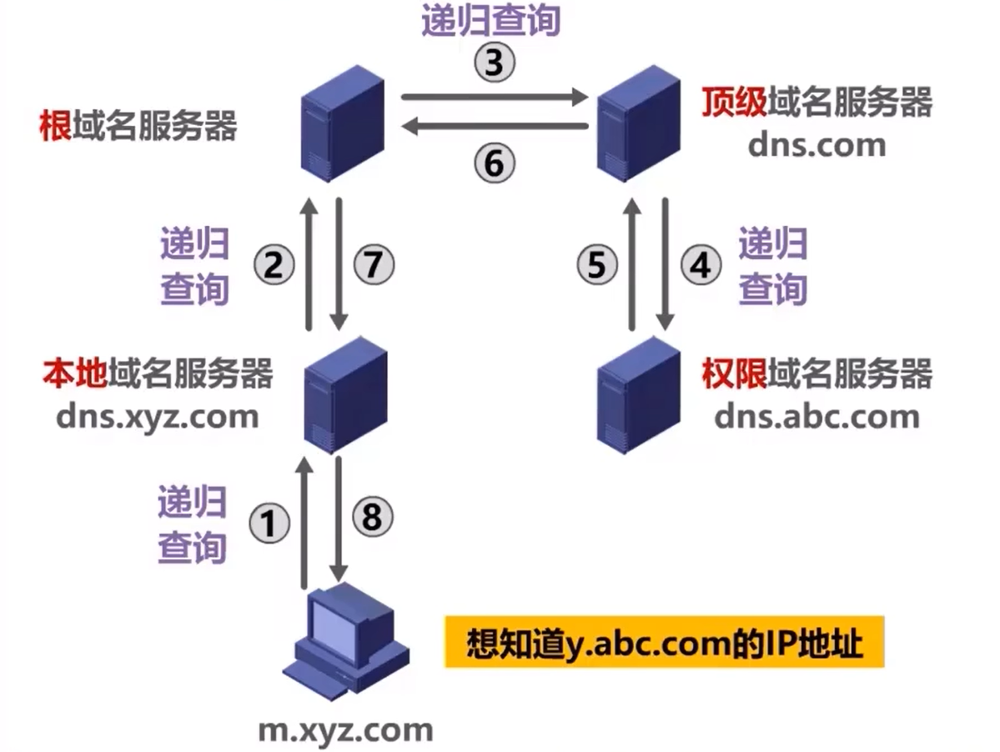

#### 迭代查询

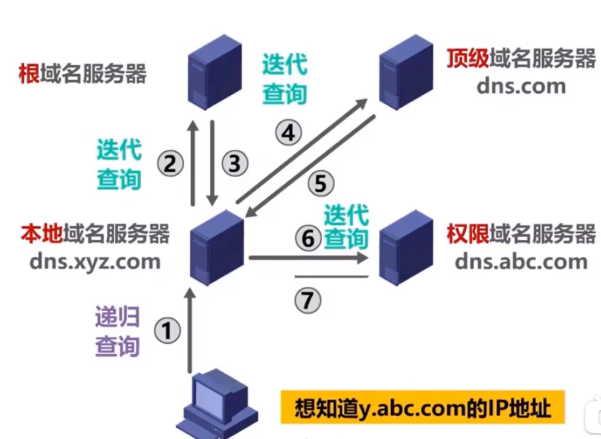

## FTP（文件传送协议）

提供交互式的访问，允许客户指明文件的类型和格式，允许文件具有存取权限

屏蔽了各个系统的细节，适合在异构网络中使用

客户可以往服务器里存文件，也可以取文件

使用端口号21

> 浏览器开头的ftp://

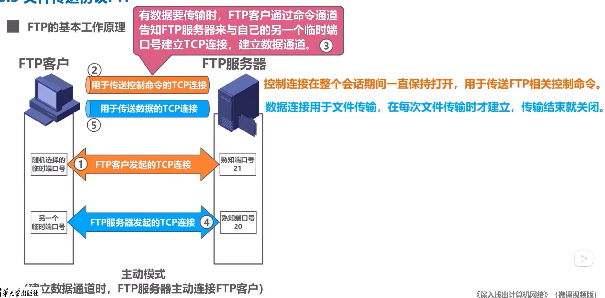

被动模式：建立数据通道时，FTP服务器被动等待FTP客户的连接，此时使用一个临时端口号，而不是20 

> 使用TCP连接

## E-mail

使用C/S方式

主要构件：用户代理，邮件服务器，使用的协议

用户代理：用户与E-mail系统之间的接口，又称电子邮件客户端软件

邮件服务器：所有ISP都有邮件服务器，负责收发邮件和维护用户邮箱

协议：包括发送协议，如SMTP，和接收协议，如POP3、IMAP

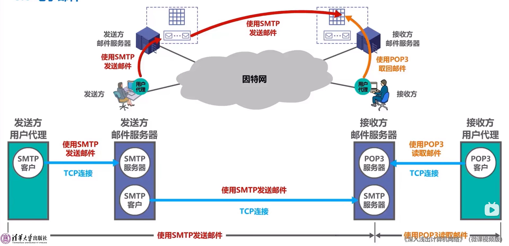

### SMTP（简单邮件传送协议）

发送方周期性对邮件缓存扫描，发现有邮件，则与服务器建立TCP连接

服务器端口使用熟知端口25

共有14条SMTP命令和21条SMTP应答

仅支持7bitASCII码文件数据，不支持多媒体和相当一部分非英语国家文字

对此提出了MIME（多用途因特网邮件扩展），MIME实现非ASCII数据和ASCII数据之间的转换

MIME增加了5个邮件首部字段，定义多种邮件内容格式，定义了传送编码

> MIME也用于HTTP

#### 流程

建立连接

图中粗体处为命令和应答

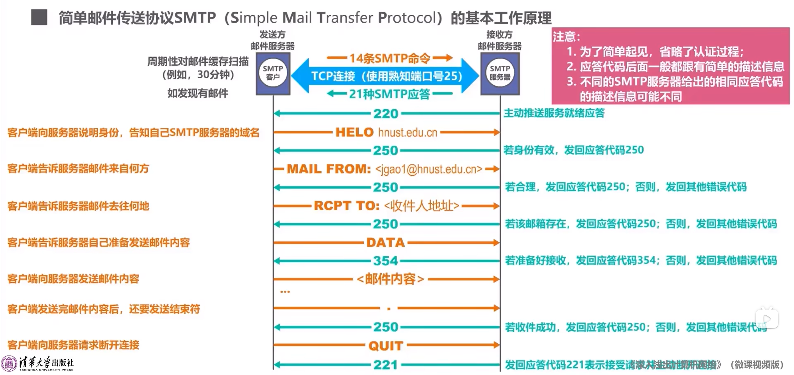

> 220后面可能跟有描述信息，如服务器的域名等

> 若身份无效则发其他代码，如421表示服务不可用

#### 邮件信息格式

由文档定义，而不是SMTP

包含信封和内容，内容分为首部和主体

首部包括From，To，Cc，Subject，信封会自动提取To和Subject

### POP（邮局协议）与IMAP（因特网邮件访问协议）

均使用基于TCP连接的C/S方式

POP：目前的第三个版本POP3，使用端口110

用户仅能以下载并删除/保留的方式从服务器中下载邮件，不允许用户在服务器上管理自己的邮件

IMAP：用户可以在自己的计算机上操作服务器中的邮箱，是一个联机协议，使用端口143

> 现在基本使用基于万维网的电子邮件，使用浏览器进行登录，使用HTTP协议给服务器发信息

## WWW（万维网）

使用网页之间的超链接将不同网站的网页链接成一张信息网

是一个允许在因特网上的分布式应用

浏览器最重要的是渲染引擎（浏览器内核），负责对网页内容进行解析和显示

使用统一资源定位符URL来指明因特网上的任何类型的资源

URL：<协议>://<主机>:端口/<路径>

HTML使用多种标签描述网页的结构和内容

CSS从审美的角度描述网页的样式

JavaScript：用于控制网页的行为，与java无关

### HTTP

定义了浏览器怎么向万维网服务器请求万维网文档，以及服务器怎么把文档传回服务器

**HTTP/1.0**采用非持续连接方式，每次请求一个文件都有建立一次TCP连接，收到响应后立即关闭

每请求一个对象就要花2RTT的开销，一个网页可能有多个对象

通常建立多个并行的TCP连接请求对象，对服务器负担重

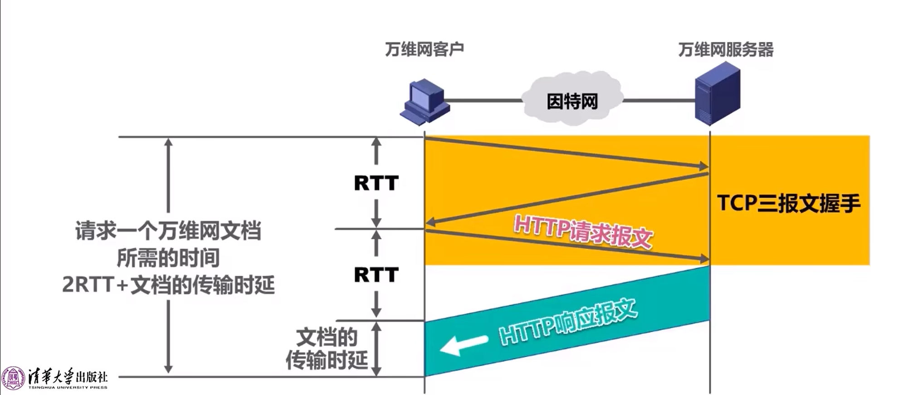

**HTTP/1.1**使用持续连接方式，响应后仍然保存连接

可以使用流水线方式提供效率，i.e.收到响应报文前连续发送多个请求报文

#### 报文格式

面向文本，每个字段都是一些ASCII码串，长度不定

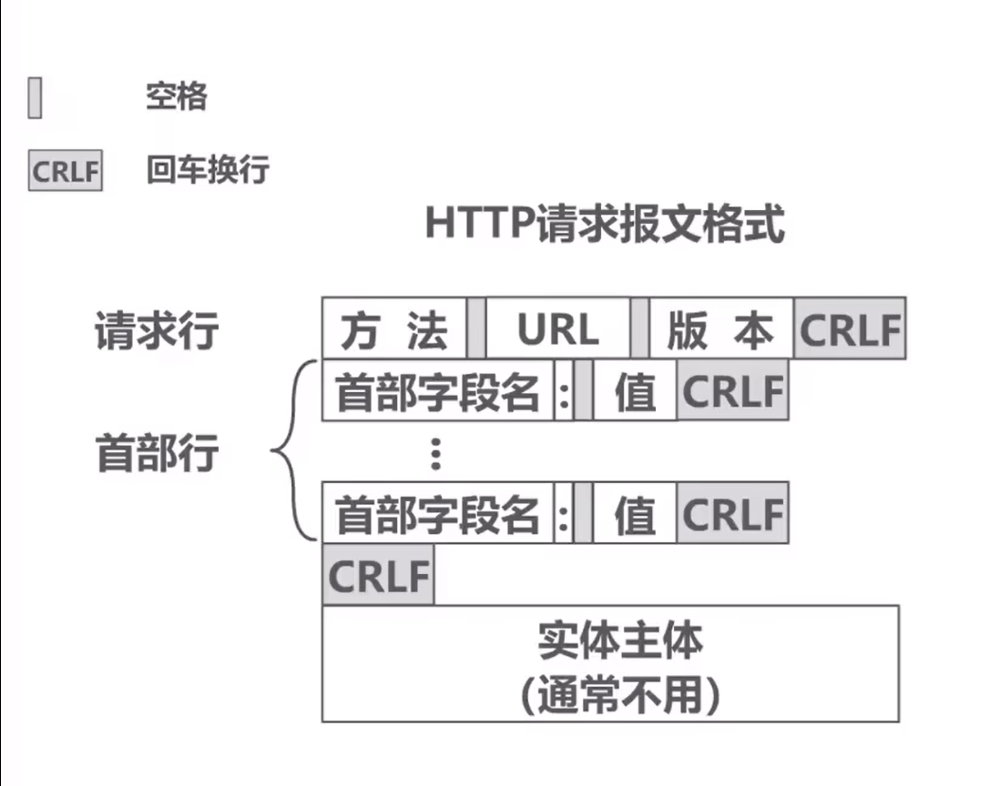

例子：

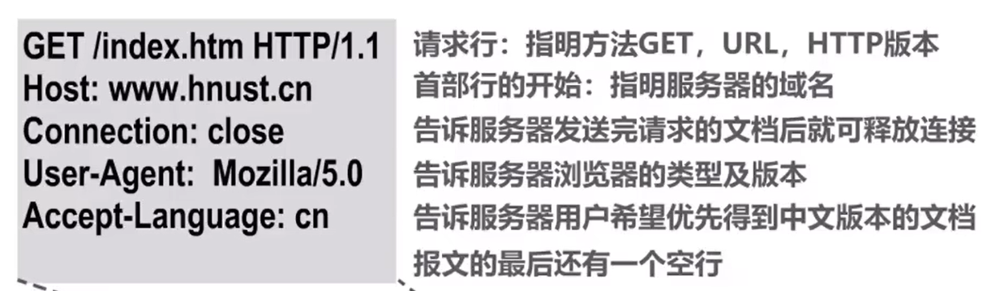

| 方法    | 描述                                          |
| ------- | --------------------------------------------- |
| GET     | 请求URL标志的文档                             |
| HEAD    | 请求URL标志的文档的首部                       |
| POST    | 向服务器发送数据                              |
| PUT     | 在指明的URL下存储一个文档                     |
| DELETE  | 删除URL标志的文档                             |
| CONNECT | 用于代理服务器                                |
| OPTIONS | 请求一些选项信息                              |
| TRACE   | 用来进行环回测试                              |
| PATCH   | 对PUT方法的补充，用来对已知资源进行局部更新千 |

> 表格不强求

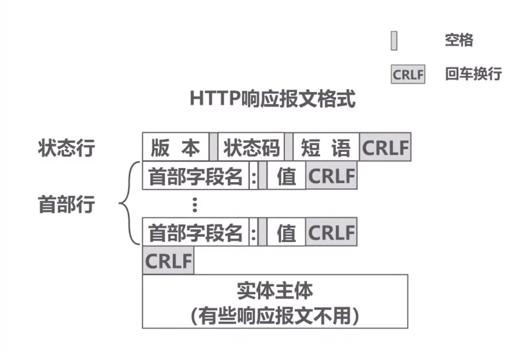

| 状态码分类 |                        描述                        |
| :--------: | :------------------------------------------------: |
|    1XX     |      表示通知信息，如请求收到了或正在进行处理      |
|    2XX     |         表示成功，如请求被接受或已处理完成         |
|    3XX     |    表示重定向，要完成请求还必须采取进一步的行动    |
|    4XX     | 表示客户端错误，如请求中有错误的语法或无法完成请求 |
|    5XX     |      表示服务器错误，如服务器失效无法完成请求      |

> 实际共33种

### Cookie

早期HTTP为无状态的协议，后来有了识别用户的需要

Cookie是对无状态的HTTP进行状态化的技术

#### 原理

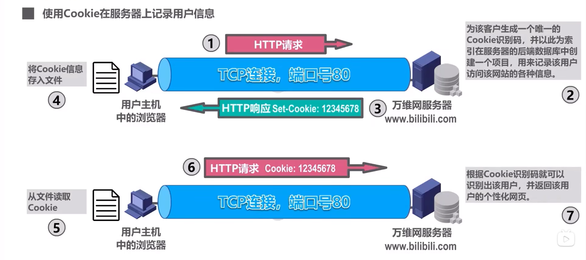

### 万维网缓存与代理服务器

又称Web缓存，可以位于客户机，中间系统，其中中间系统上的又称为代理服务器

Web缓存将最近的一些请求和响应存在本地磁盘中，新请求到达时，在Web缓存的资源可以直接返回，无须提供因特网重复访问

Web缓存中的资源有Last_Modified和Expires两个属性，用于存最后修改时间和过期时间，未过期会正常允许

过期会允许以下过程，若未修改（对比Last_Modified和If_modified-since），响应为304，反之发新文档

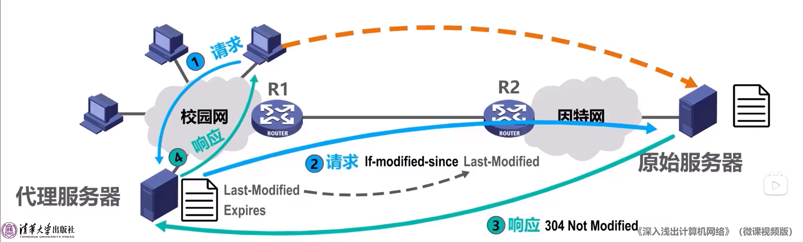

